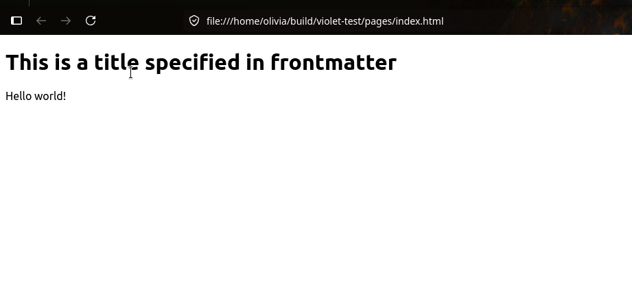
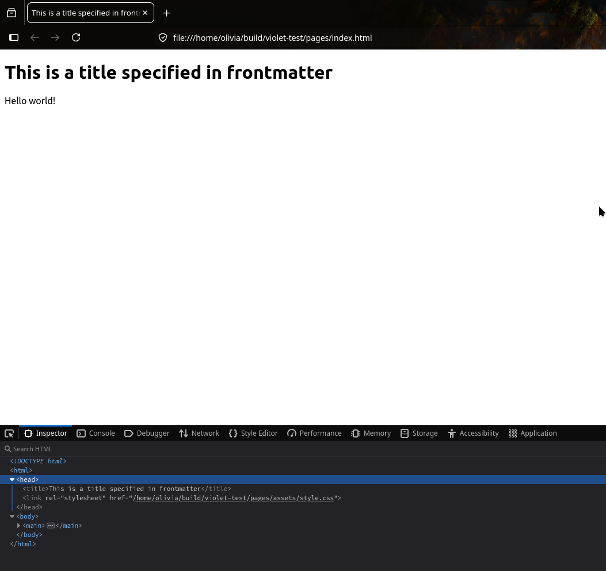
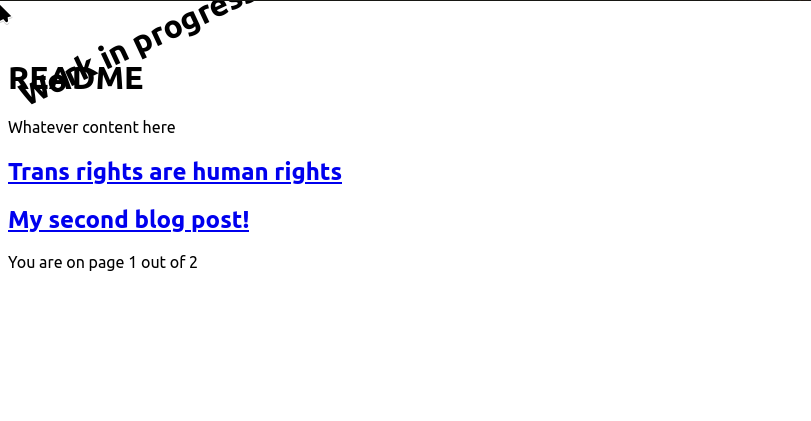

---
{
    "title": "Writing templates"
}
---
# Writing templates

This page uses a real-world example to demonstrate how templates work. To get started, you'll need:

* Violet installed
* A basic project set up. This means a basic `violet.json`, and a markdown file with some content. If you don't have one, see [Getting started](/Getting started.md).
  * Note: for simplicity, I recommend making a `README.md`, as this document assumes you at least have one.

Before we get started, you need to decide if you want to make a theme or project-local templates. You can change your mind later by copying the folders to the other location.

Note that this is not an HTML tutorial. All the code you need is included, but basic HTML will not be explained. It's assumed you either know or can figure it out while doing the tutorial. [MDN](https://developer.mozilla.org/en-US/) is a useful resource if you need a place to look.

{{ page.table_of_contents }}

## Pre-template setup

### I want a project-local template (recommended)

```
mkdir _templates
mkdir _partials
# assets is not a magic name, it's just my personal preference.
# You can call this anything else if you want.
mkdir assets
```


### I want a theme

Please note that project-local templates are recommended over themes for this guide. This is purely because themes have more setup cost. If you want to just get to the templating bits, project-local templates are much faster.

First, you'll need to create your folders:
```
mkdir themes
mkdir themes/my-silly-theme/
mkdir themes/my-silly-theme/_templates
mkdir themes/my-silly-theme/_partials
# assets is not a magic name, it's just my personal preference.
# You can call this whatever you want, but if you rename it,
# you must also update `violet.theme.json`
mkdir themes/my-silly-theme/assets
```

For the rest of this document, when `_templates` is mentioned, you use `themes/my-silly-theme/_templates`, and equivalent for `_partials`. Additionally, you'll need a `violet.theme.json`:

```
cat > themes/my-silly-theme/violet-theme.json <<EOF 
{
    "mount": [
        "assets"
    ]
}
EOF
```

This is required for the `assets` folder to be copied to the output, and your site by extension. For an extended explaination of how `mount` works, see [the docs for themes](Themes.md).

You'll then need to add `"theme": "my-silly-theme"` to your `violet.json`.

## Setting up a basic page

One of the convenient parts about templates is that you can incrementally build your page in steps as needed. This depends purely on the granularity of control you want, and how much code you share between different types of templates. For now, let's set up a basic page:

`_templates/_default/base.inja`
```inja
<!DOCTYPE html>
<html>
    <head>
    </head>
    <body>
        <main>
            
            
        </main>
    </body>
</html>
```

> [!tip]
> The `_default` is a special `type` that is, shock, the default. You can declare additional types to switch between sets of layouts. The frontmatter declaration to switch a type is `"type": "my_type"`.
>
> Violet will then check in `_templates/my_type` first, before checking `_default` if no matching layout is found.
>
> For now, you don't need to worry about this.

<!-- TODO: The above is potentially unclear. -->

The main feature you need to notice right now is the `block`. A block lets us define a location for an arbitrary template bit to be inserted. In this case, all we care about is the content, so we declare a block and name it content. If we actually want to use this, all we need to do is `extends` the template, and define `block content` in a new file.

Let's start by rendering a `single_page`. The `single_page` is the default layout. Any page that doesn't specify a layout is implied to have `"layout": "single_page"`. 

`_templates/_default/single_page.inja`
```inja


    <h1>{{ page.title }}</h1>
    {# this statement includes the HTML content of the site, i.e. whatever you put in the markdown file formatted as HTML #}
    {# This has no relation to the name of the block, and you can use this anywhere (multiple times on the same page, even!) #}
    

```

Here we see another `block`, but this redefinition places the contents of the block inside the location in the previous block. In other words, the block in `single_page.inja` gets placed inside the `<main>` tag from `base.inja`. 

You can now try generating the site with `violet generate -l`, and opening a file (`xdg-open pages/index.html`). If you've done this previously, you may now notice that the page is rather blank:



This lines up well with the contents of my README:

```markdown
---
{
    "title": "This is a title specified in frontmatter"
}
---
Hello world!
```

> [!tip]
>
> To get a title that isn't the filename, you'll need to add a title to the frontmatter of your file. Try doing that now if you haven't already.

## Expanding the base template

As it stands right now, the page is a bit barren. We can do better! Let's go back to `base.inja` and add some includes:

```inja
<!DOCTYPE html>
<html>
    <head>
        
    </head>
    <body>
        
        <main>
            
            
        </main>
    </body>
</html>
```

`partials/*` in an `include` is a special syntax that looks for the file in the `_partials` directory. The directory starts with an underscore, while the include statements do not.

> [!tip]
>
> If you opted for project-local templates and regenerated the site immediately, you may have noticed that you got a header and some styling. This is from the default theme. You can disable this with `"theme": null` in your `violet.json`
>
> If you chose to build a theme, you won't see this, as the default theme is fully replaced by your theme. 

For this to be useful in your theme, you'll need to create these two files. Let's start by creating both, and focusing on `head.inja` for now:

1. Create `_partials/head.inja`
2. Create `_partials/header.inja`
3. Run `violet generate -l` and reload the page. You should not get an error, and the page should look identical to the previous step.

Now, open `_partials/head.inja` in an editor. The goal is to do two things:

1. Set a page title
2. Load a CSS file

The CSS file does not exist yet, but that'll just be a 404 in the browser, so we can ignore this for now. We are also skipping all the standard good-practice metadata for brevity.

```inja
{# We just set the title to the page title. This will always be defined #}
<title>{{ page.title }}</title>

{# Note the use of `site.prefix` here; this is good practice even if your site 
   will live directly at `https://example.com/`, and is required for `generate -l`
  to work properly. Otherwise, an absolute path in local file mode would try to look
  for the CSS file under your root directory!
#}
<link rel="stylesheet" href="{{ site.prefix }}/assets/style.css" />
```



In my case, it renders with `<link rel="stylesheet" href="/home/olivia/build/violet-test/pages/assets/style.css">`, which is the complete path to the build directory where I sanity-checked this documentation. Without `{{ site.prefix }}`, it would've tried to link to `file:///assets/style.css`, which naturally does not exist.

Finally, we can add some CSS! Open `assets/style.css` in your editor. If you're following along with a theme, make sure to place it under the theme folder and not the root folder. You can add any CSS you want to the file, or just copy this:

```css
h1:before {
    content: "Work in progress!";
    rotate: -25deg;
    display: block;
    width: fit-content;
}
```

### Bonus exercise

You now have a blank `header.inja`: try adding a basic header to it. You can also expand it in the same way to add a `footer.inja`, or whatever else you want.

If you want more data from the page, see [the frontmatter schema](/schemas/Frontmatter.md).

## Paginated `page_list`s 

The other major built-in type of page is the `page_list`. As the name suggests, it's a special page type for lists. However, the default type doesn't have anything special enabled. You can use `page_list` as a manual list, and call some special methods to manually list out files. However, this disables functionality like pagination, due to how the engine works. If you want pagination, which will be most real-world examples, you'll want a paginated page list.

Paginated page lists are a subset of `page_list`s with some extra config options. Specifically, it's defined as a `"layout": "page_list"` where the additional `"listing": {}` object is present and not null. `listing` is where the options for the cool features of the pagination are defined. However, for now, you do not need to worry about these. 

Let's create a file and set the `page_size` to 2. The reason we do this is to make it easier to provoke pagination to make it more obvious what's going on. Create `blog/README.md` and populate it with:

```inja
---
{
    "layout": "page_list",
    "listing": {
        "page_size": 2
    }
}
---

Whatever content here
```

Paginated page lists always operate on the folder they're in by default, which is why we're moving it to a separate folder. Then, we'll create some fake blog posts:

`blog/2026-01-01-my-first-post.md`
```
---
{
    "title": "My first blog post!",
    "date": "2026-01-01T02:00:00+00:00"
}
---

Content
```

`blog/2026-01-02-my-second-post.md`
```
---
{
    "title": "My second blog post!",
    "date": "2026-01-02T02:00:00+00:00"
}
---

Content
```

`blog/2026-01-03-my-third-post.md`
```
---
{
    "title": "Trans rights are human rights",
    "date": "2026-01-02T02:00:00+00:00"
}
---

Content
```

You can fill these with whatever you want. By default, paginated page lists sort by `date` first and filename second, but in this case, we redundantly make sure both are sorted. 

Similarly to `single_page.inja`, you'll now create `_templates/_default/page_list.inja`, and we'll start like last time:

```inja


    <h1>{{ page.title }}</h1>
    

    
        
            <h2><a href="{{ site.prefix }}/{{ it.url }}">{{ it.title }}</a></h2>
        

        <p>You are on page {{ listing.page }} out of {{ listing.total_pages }}</p>

    

```

Everything inside the `if` statement is new, but aside this, everything else is identical to `single_page`; the default `<h1>` and the content include lets you still write content on the markdown page, and have it render. 

You can now `violet generate -l`, and `xdg-open pages/blog/index.html`:



### A note on where pages go

If you look at the logs when you generate, you're told where the pages go. Here's the complete output of my run:
```
22:13:31.604 | info     | Using /home/olivia/build/violet-test as the project root
22:13:31.604 | info     | Overriding site prefix to /home/olivia/build/violet-test/pages
22:13:31.604 | info     | No theme set
22:13:31.606 | info     | Committing generated page to pages/blog/2026-01-02-post1.html
22:13:31.608 | info     | Committing generated page to pages/blog/index.html
22:13:31.608 | info     | Committing generated page to pages/blog/page/1/index.html
22:13:31.609 | info     | Committing generated page to pages/blog/page/2/index.html
22:13:31.610 | info     | Committing generated page to pages/blog/2026-01-04-post3.html
22:13:31.610 | info     | Committing generated page to pages/blog/2026-01-03-post2.html
22:13:31.611 | info     | Committing generated page to pages/index.html
```

`pages/blog/page/1/index.html` is identical to `pages/blog/index.html`, but they are two separate files in the filesystem. This is to get around basic limits of how static sites work in general - the files have to be rendered ahead of time, and violet's default is `{folder for the page_list}/page/{number}/index.html`, in addition to `{folder for the page list}/{translated file name}.html`. This means that navigation between pages, as long as you don't care about the difference in your pagination controls, is fairly easy.

### Writing pagination controls

Writing the full pagination controls is left as an exercise to the reader. The pagination controls on my website are no less than 47 lines at the time of writing - but it could be much shorter if I had written it in javascript instead.

Consequently, actually writing the full controls is left as an exercise to the reader. However, for now, we'll settle for some very basic controls. In `page_list.inja`, add:

```inja
<ul>
    
        <li title="Go to page {{ i }}">
            <a href="{{ site.prefix }}/{{ paginatedUrl(listing.base_path, i) }}"
                id="next-page"
                aria-label="Next page"
            >{{ i }}</a>
        </li>
    
</ul>
```

This also does a lot:

* `createPaginatedList`: A utility method created specifically for pagination controls. It returns valid page indices for one possible set of controls. It returns up to 9 indices depending on the total number of pages and the current page. See [the docs for the method for more info](/templating/functions/lang.md#createpaginatedlistpagenum-totalpages)
* `paginatedUrl`: used to dynamically create a valid URL to a given page. This lets us define it as an absolute path to avoid weird behaviour since page 1 has two valid locations.
* `listing.base_path` provides a base path that can be used to build the stable `/page/num/index.html` paths. This is stable between the `/page/N/index.html` generations and the `/index.html` generation, so you know you're always referring to the same folder.

If this confuses you, you don't have to use it. You can also write the controls in JavaScript.

If you now render the page, you'll get a bullet list with two links (with the 3 posts set up for this guide).

## Closing words

Page lists and pagination is by far the most complex part of violet - and most static site generators for that matter. Pagination is a hard problem to solve when you can't just work around the problem by slapping `?page=1234` on the URL, and the internals of a tool obscure the actual data flow. Or at least that's my personal view. However, the core of it is not hard: you're provided a `listing` object that includes `listing.pages`, which contains one page worth of listed pages. The template is processed multiple times, one for each page there is to generate. The internals of how that happens is ✨ magic ✨ that isn't important.

Pagination controls are more involed, but you can get around it without using any violet features. You can pass the current page and total pages to a javascript function call if you prefer.

You have now seen the core feature set of violet. The rest of the job now is expanding the bits you need to get the site you want, most of which bases itself on the principles used here. There are more ways to structure templates than what I have shown here, and more ways to implement features. I personally prefer to avoid javascript where possible, but that's just my preference.

If you want an even more complicated reference, [my website](https://codeberg.org/LunarWatcher/pages) implements its own project-local templates that cover the vast majority of the functionality. The `_default` theme, primarily intended for documentation sites (and the one used for violet's doc site) is more lacking in the feature department. In the long run, I'd like to get a more comprehensive theme set up that can be used as a reference or a starting point, but violet is still very much early in development still.

If you have read this far, I do hope I didn't scare you off :p If you have questions or feedback about this page, [feel free to open an issue](https://codeberg.org/LunarWatcher/violet/issues). Violet won't be disappearing any time soon, as it's currently the foundation for several doc sites in my repos, as well as my own website. It can only go up from here :D

